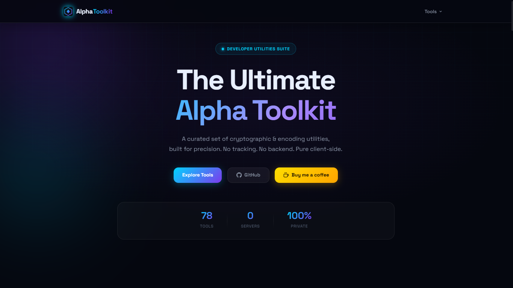
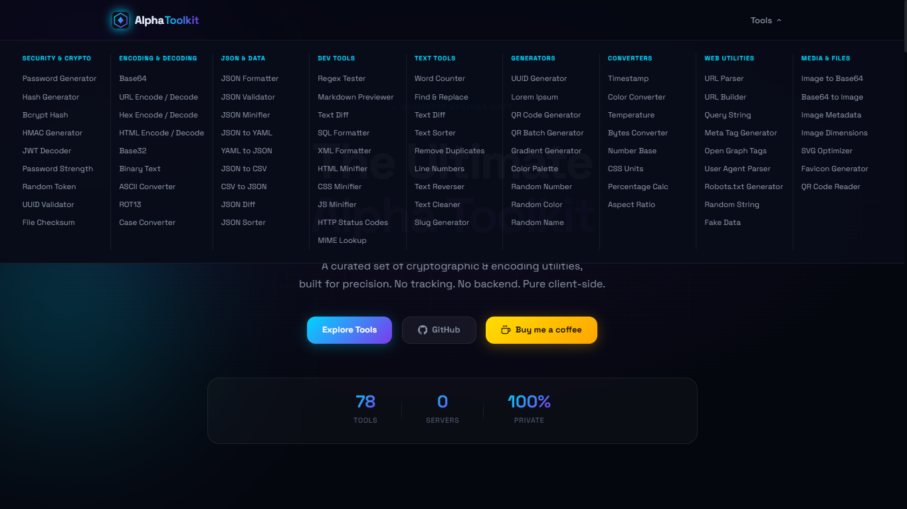
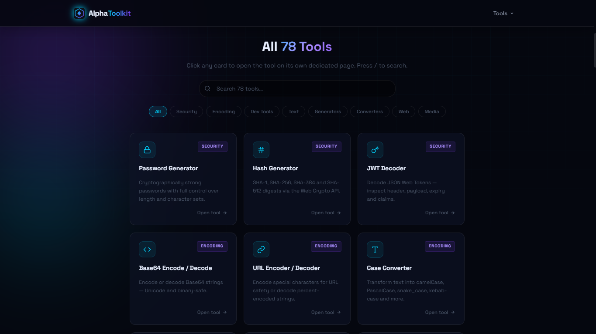
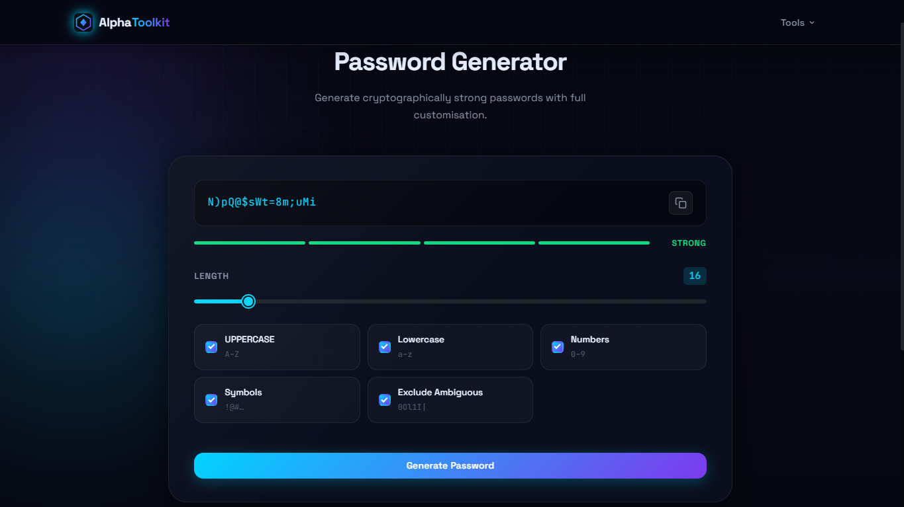

<div align="center">


# Alpha Toolkit

### 78 free developer utilities — all in your browser, zero data leaving your device.

[](https://byalphas.github.io/alpha-toolkit/)
[](#tools)
[](LICENSE)
[](#)
[](#)

```bash
git clone https://github.com/byalphas/alpha-toolkit.git
```

**[→ Open Alpha Toolkit](https://byalphas.github.io/alpha-toolkit/)**

</div>

---

## Why Alpha Toolkit?

Most online developer tools come with a hidden cost: your data is sent to someone's server, you're tracked across sessions, or the tool simply stops working when the service goes offline.

**Alpha Toolkit does none of that.**

- 🔒 **Your data never leaves your browser.** Every operation — hashing, encoding, password generation, file analysis — runs locally using native browser APIs (Web Crypto, FileReader, Canvas). Nothing is sent to any server.
- ⚡ **Instant.** No sign-up, no loading spinners, no API rate limits. Open a tool and start using it immediately.
- 🌐 **Works offline.** Once the page loads, you can disconnect from the internet and every tool keeps working.
- 🚫 **Zero ads, zero tracking, zero cookies.** No Google Analytics, no telemetry, no fingerprinting.
- 🛠️ **78 tools in one place.** Stop juggling dozens of different websites for different tasks.
- 🪶 **Lightweight.** Pure HTML + CSS + Vanilla JS. No frameworks, no npm, no build step. One CSS file, loads in milliseconds.

---

## Live Demo

🌐 **[https://byalphas.github.io/alpha-toolkit/](https://byalphas.github.io/alpha-toolkit/)**

---

## Screenshots

<div align="center">



<br /><br />



<br /><br />

<table>
  <tr>
    <td></td>
    <td></td>
  </tr>
</table>

</div>

---

## Tools

### 🔐 Security & Crypto
| Tool | Description |
|------|-------------|
| [Password Generator](tools/password.html) | Cryptographically strong passwords with custom rules |
| [Password Strength](tools/password-strength.html) | Score and analyze password weakness |
| [Hash Generator](tools/hash.html) | SHA-1, SHA-256, SHA-384, SHA-512 via Web Crypto API |
| [HMAC Generator](tools/hmac.html) | HMAC-SHA256/512 with secret key |
| [Bcrypt Hash](tools/bcrypt.html) | Generate and verify bcrypt hashes |
| [Random Token](tools/random-token.html) | Cryptographically secure random tokens |
| [UUID Generator](tools/uuid.html) | RFC 4122 v4 UUID (bulk mode included) |
| [UUID Validator](tools/uuid-validator.html) | Validate UUID format and version |
| [JWT Decoder](tools/jwt-decoder.html) | Decode header, payload and analyze claims |
| [File Checksum](tools/file-checksum.html) | SHA-256 / MD5 checksum for any file |

### 🔡 Encoding & Decoding
| Tool | Description |
|------|-------------|
| [Base64](tools/base64.html) | Encode / decode Base64 strings |
| [Base64 to Image](tools/base64-to-image.html) | Preview and download Base64 image data URIs |
| [Base32](tools/base32.html) | Base32 encode / decode |
| [URL Encode/Decode](tools/url-codec.html) | Percent-encoding for URLs |
| [HTML Encode/Decode](tools/html-codec.html) | HTML entity encode / decode |
| [Hex Codec](tools/hex-codec.html) | Text ↔ Hexadecimal |
| [Binary Text](tools/binary-text.html) | Text ↔ Binary |
| [ROT13](tools/rot13.html) | ROT13 cipher |
| [ASCII Converter](tools/ascii.html) | Text to ASCII codes and back |

### 📦 JSON & Data
| Tool | Description |
|------|-------------|
| [JSON Formatter](tools/json-formatter.html) | Prettify JSON with syntax highlighting |
| [JSON Validator](tools/json-validator.html) | Validate with line-level error reporting |
| [JSON Minifier](tools/json-minifier.html) | Strip whitespace from JSON |
| [JSON Sorter](tools/json-sorter.html) | Sort keys alphabetically |
| [JSON Diff](tools/json-diff.html) | Visual diff between two JSON objects |
| [JSON to CSV](tools/json-to-csv.html) | Convert JSON arrays to CSV |
| [JSON to YAML](tools/json-to-yaml.html) | JSON → YAML conversion |
| [CSV to JSON](tools/csv-to-json.html) | CSV → JSON conversion |
| [YAML to JSON](tools/yaml-to-json.html) | YAML → JSON conversion |

### 📝 Text Tools
| Tool | Description |
|------|-------------|
| [Word Counter](tools/word-counter.html) | Words, characters, sentences, paragraphs |
| [Text Diff](tools/text-diff.html) | Line-by-line text comparison |
| [Find & Replace](tools/find-replace.html) | Regex-powered find and replace |
| [Case Converter](tools/case-converter.html) | camelCase, UPPER, lower, Title, snake_case… |
| [Slug Generator](tools/slug.html) | URL-safe slug with Unicode support |
| [Text Sorter](tools/text-sorter.html) | Sort lines alphabetically, reverse or shuffle |
| [Text Reverser](tools/text-reverser.html) | Reverse text or character order |
| [Text Cleaner](tools/text-cleaner.html) | Strip extra spaces, special characters |
| [Deduplicate Lines](tools/deduplicate-lines.html) | Remove duplicate lines |
| [Line Numbers](tools/line-numbers.html) | Add line numbers to text |
| [Lorem Ipsum](tools/lorem-ipsum.html) | Generate placeholder text |
| [Markdown Preview](tools/markdown.html) | Live Markdown → HTML preview |
| [Regex Tester](tools/regex-tester.html) | Test and highlight regex matches |

### 🌐 Web & URL
| Tool | Description |
|------|-------------|
| [URL Parser](tools/url-parser.html) | Break URL into protocol, host, path, query |
| [URL Builder](tools/url-builder.html) | Build full URLs from components |
| [Query String](tools/query-string.html) | Parse and serialize query strings |
| [HTTP Status Codes](tools/http-status.html) | Searchable HTTP status code reference |
| [User Agent Parser](tools/user-agent.html) | Detect browser and OS from UA string |
| [Meta Tags Generator](tools/meta-tags.html) | Generate SEO meta tag HTML |
| [Open Graph Tags](tools/open-graph.html) | OG / Twitter Card meta tags |
| [Robots.txt Generator](tools/robots-generator.html) | Build robots.txt rules |
| [MIME Lookup](tools/mime-lookup.html) | File extension → MIME type |

### 🖼️ Image & QR
| Tool | Description |
|------|-------------|
| [Image to Base64](tools/image-to-base64.html) | Convert image to Base64 data URI |
| [Image Dimensions](tools/image-dimensions.html) | Get width, height and file info |
| [Image Metadata](tools/image-metadata.html) | Read EXIF and file metadata |
| [Favicon Generator](tools/favicon-generator.html) | Generate SVG favicon from text or emoji |
| [QR Code Generator](tools/qr-generator.html) | QR codes for URLs, text or vCards |
| [QR Batch Generator](tools/qr-batch.html) | Bulk QR code generation |
| [QR Code Reader](tools/qr-reader.html) | Read QR codes from image or camera |
| [SVG Optimizer](tools/svg-optimizer.html) | Clean and shrink SVG markup |
| [Gradient Generator](tools/gradient.html) | CSS gradient builder with live preview |
| [Color Converter](tools/color-converter.html) | HEX ↔ RGB ↔ HSL ↔ OKLCH |
| [Color Palette](tools/color-palette.html) | Generate complementary color palettes |
| [Random Color](tools/random-color.html) | Random color generator with filters |

### 💻 Code Tools
| Tool | Description |
|------|-------------|
| [CSS Minifier](tools/css-minifier.html) | Minify CSS with size savings report |
| [JS Minifier](tools/js-minifier.html) | Minify JavaScript |
| [HTML Minifier](tools/html-minifier.html) | Minify HTML and strip comments |
| [SQL Formatter](tools/sql-formatter.html) | Format SQL queries for readability |
| [XML Formatter](tools/xml-formatter.html) | Prettify XML with indentation |

### 🔄 Converters
| Tool | Description |
|------|-------------|
| [Unit Converter](tools/unit-converter.html) | Length, area, volume, weight |
| [Temperature](tools/temperature.html) | °C ↔ °F ↔ K ↔ °R |
| [Number Base](tools/number-base.html) | Binary, octal, decimal, hex |
| [Bytes Converter](tools/bytes.html) | Byte, KB, MB, GB, TB |
| [Percentage Calculator](tools/percentage.html) | Percentage and ratio calculator |
| [Aspect Ratio](tools/aspect-ratio.html) | Calculate width/height ratios |
| [Timestamp](tools/timestamp.html) | Unix timestamp ↔ date/time |

### 🎲 Generators
| Tool | Description |
|------|-------------|
| [Random String](tools/random-string.html) | Custom character set random strings |
| [Random Number](tools/random-number.html) | Random numbers in any range |
| [Random Name](tools/random-name.html) | Fake name generator |
| [Fake Data](tools/fake-data.html) | Bulk fake dataset generator (JSON/CSV) |

---

## Project Structure

```
alpha-toolkit/
│
├── index.html              # Homepage — hub grid, mega menu, live search
├── style.css               # Unified stylesheet (~5300 lines, zero @imports)
├── sitemap.xml             # SEO sitemap
├── robots.txt              # Crawler directives
│
├── tools/                  # 78 individual tool pages
│   └── *.html
│
└── assets/
    ├── fonts/              # Self-hosted variable fonts (TTF)
    │   ├── SpaceGrotesk.ttf
    │   ├── JetBrainsMono.ttf
    │   └── JetBrainsMono-Italic.ttf
    │
    ├── images/             # Favicons and project screenshots
    │   ├── favicon.svg
    │   ├── favicon-192.svg
    │   └── favicon-512.svg
    │
    ├── css/                # Modular source files (inlined into style.css)
    │   ├── core.css        # CSS variables, reset, animations
    │   ├── components.css  # Nav, cards, buttons, forms, toasts
    │   └── pages/
    │       ├── home.css    # Hero, hub grid, hub cards
    │       └── tool.css    # Tool layout, footer
    │
    └── js/
        ├── core/
        │   ├── utils.js        # copyToClipboard, showToast, debounce…
        │   ├── nav.js          # Mega menu toggle, scroll throttle (RAF)
        │   └── tools-data.js   # Metadata array for all 78 tools
        ├── pages/
        │   └── home.js         # Hub card render, live search & filters
        ├── vendor/             # Self-hosted third-party libs (QR tools)
        │   ├── qrcode.min.js
        │   ├── jsQR.min.js
        │   └── qrious.min.js
        └── tools/              # Per-tool JS modules (78 files)
            └── *.js
```

---

## Tech Stack

| Layer | Technology |
|-------|-----------|
| Markup | Semantic HTML5 |
| Styling | Pure CSS3 — Custom Properties, Grid, Flexbox |
| Logic | Vanilla JavaScript (ES2020+) |
| Crypto | Web Crypto API (`crypto.subtle`) |
| File ops | FileReader API, Canvas API |
| Hosting | GitHub Pages |
| Build | **None** — no npm, no bundler, no dependencies |

---

## Performance

| Optimization | Impact |
|---|---|
| Zero CSS `@import` — single `style.css` | 5 HTTP requests → 1 |
| `defer` on all scripts | Zero render blocking |
| Self-hosted variable fonts with `font-display: swap` | No external font requests, instant fallback |
| `content-visibility: auto` on sections | Off-screen rendering skipped |
| `requestAnimationFrame` scroll throttle | No layout thrash on scroll |

---

## Running Locally

No build step, no dependencies, no npm install. Just clone and open:

```bash
git clone https://github.com/byalphas/alpha-toolkit.git
cd alpha-toolkit
```

Then either open `index.html` directly in your browser, or serve it locally to avoid CORS issues on some tools:

```bash
# Python (built-in)
python -m http.server 8080

# Node.js
npx serve .
```

Visit `http://localhost:8080` — every tool works fully offline from this point.

---

## Deploying to GitHub Pages

1. Push the repository to GitHub.
2. Go to **Settings → Pages**.
3. Set **Source** to `Deploy from a branch` → `main` → `/ (root)`.
4. Click **Save**. The site will be live at `https://<username>.github.io/<repo>/` within a minute.

No build action or workflow file required — the site is already fully static.

---

## Adding a New Tool

1. Create `tools/your-tool.html` following the existing tool page structure.
2. Create `assets/js/tools/your-tool.js` for the tool logic.
3. Add an entry to `assets/js/core/tools-data.js` (id, title, category, tags).
4. Add a link to the mega menu and mobile nav in `index.html`.
5. Update the tool count (`78`) in `index.html` — title, meta, hero stat, hub heading, footer.
6. Add the URL to `sitemap.xml`.

---

## License

Apache 2.0 © [byalphas](https://github.com/byalphas)

---

<div align="center">

Built with HTML · CSS · Vanilla JS · Web Crypto API

[⭐ Star on GitHub](https://github.com/byalphas/alpha-toolkit) &nbsp;·&nbsp; [☕ Buy me a coffee](https://buymeacoffee.com/byalpha)

</div>
