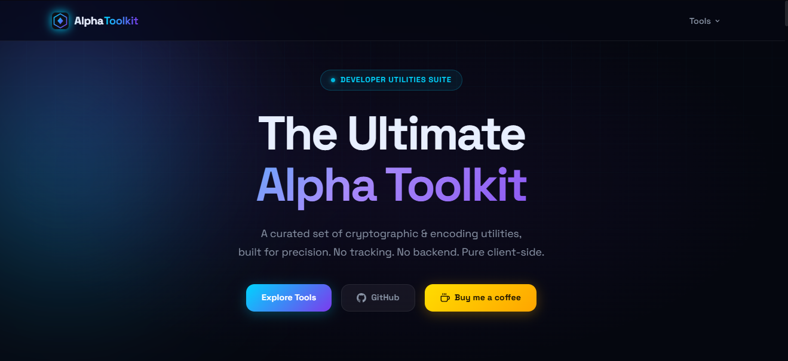
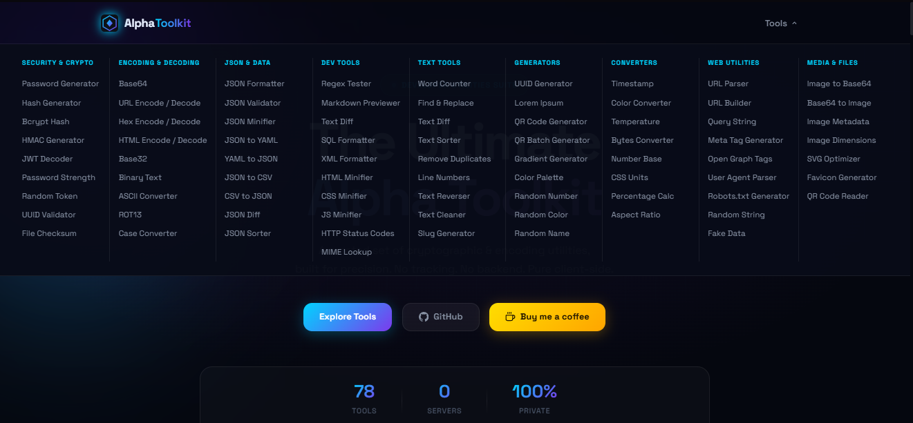
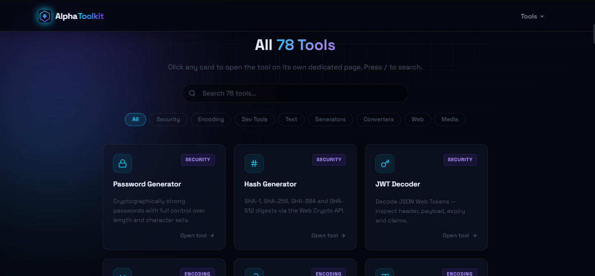

 

<h1>Alpha Toolkit</h1>

<strong>78 developer tools. All in your browser. Nothing leaves your device.</strong>

 

&nbsp;

&nbsp;

&nbsp;

&nbsp;

  

<!-- ⭐ Star the repo to get notified when we launch -->

  

---

## What is Alpha Toolkit?

Alpha Toolkit is a collection of **78 free, privacy-first developer utilities** that run entirely inside your browser.

There's no server receiving your data, no account to create, no ads, and no cookies.  
You paste your JSON, type your password, drop your file — the tool does its job locally, then that's it.

It works offline too. Once the page is loaded, disconnect your internet — everything still works.

---

## Preview

 

<!-- Screenshot 1 — Homepage / Hub (1319 × 606) -->

  

<!-- Screenshot 2 — Tool page example (1321 × 613) -->

  

<!-- Screenshot 3 — Another tool / category view (1316 × 613) -->

 

---

## Why developers will use it

| Problem with most online tools | Alpha Toolkit |
|---|---|
| Your data is sent to a server | Everything runs locally in the browser |
| Requires login or sign-up | Open and use, no account |
| Covered in ads and pop-ups | Zero ads, zero pop-ups |
| Breaks when their service goes down | Static files, works offline |
| Scattered across 30 different sites | 78 tools in one place |
| Heavy JavaScript frameworks, slow load | Pure HTML + CSS + Vanilla JS, instant |

---

## 78 Tools — Built and Ready

### 🔐 Security & Crypto
Password Generator · Password Strength Checker · Hash Generator (SHA-1/256/384/512) · HMAC Generator · Bcrypt Hash · Random Token · UUID Generator · UUID Validator · JWT Decoder · File Checksum

### 🔡 Encoding & Decoding
Base64 · Base64 to Image · Base32 · URL Encode/Decode · HTML Encode/Decode · Hex Codec · Binary Text · ROT13 · ASCII Converter

### 📦 JSON & Data
JSON Formatter · JSON Validator · JSON Minifier · JSON Sorter · JSON Diff · JSON to CSV · JSON to YAML · CSV to JSON · YAML to JSON

### 📝 Text Tools
Word Counter · Text Diff · Find & Replace · Case Converter · Slug Generator · Text Sorter · Text Reverser · Text Cleaner · Deduplicate Lines · Line Numbers · Lorem Ipsum · Markdown Preview · Regex Tester

### 🌐 Web & URL
URL Parser · URL Builder · Query String Parser · HTTP Status Codes · User Agent Parser · Meta Tags Generator · Open Graph Tags · Robots.txt Generator · MIME Lookup

### 🖼️ Image & QR
Image to Base64 · Image Dimensions · Image Metadata · Favicon Generator · QR Code Generator · QR Batch Generator · QR Code Reader · SVG Optimizer · Gradient Generator · Color Converter · Color Palette · Random Color

### 💻 Code Tools
CSS Minifier · JS Minifier · HTML Minifier · SQL Formatter · XML Formatter

### 🔄 Converters & Generators
Unit Converter · Temperature · Number Base · Bytes Converter · Percentage Calculator · Aspect Ratio · Timestamp · Random String · Random Number · Random Name · Fake Data Generator

---

## Tech Stack

| | |
|---|---|
| **Markup** | Semantic HTML5 |
| **Styles** | Pure CSS3 — Custom Properties, Grid, Flexbox |
| **Logic** | Vanilla JavaScript (ES2020+), no frameworks |
| **Crypto** | Web Crypto API (`crypto.subtle`) |
| **Hosting** | GitHub Pages |
| **Build tool** | None |
| **Dependencies** | Zero |

---

## In the meantime

The site is fully built and working locally. Launch is being held back only for a final review pass.

**What you can do right now:**

- ⭐ **Star this repo** — you'll get a GitHub notification the moment we publish
- 👁️ **Watch** the repo for releases

---

 

Built with HTML · CSS · Vanilla JS · Web Crypto API

 

© 2025 byalphas — Apache 2.0 License

